# MedGemma RAG — Architecture Documentation

> CKD Clinical Knowledge Assistant | Kaggle MedGemma Impact Challenge

---

## Table of Contents

1. [System Overview](#1-system-overview)
2. [Level 1 — Simple RAG](#2-level-1--simple-rag)
3. [Level 2 — Agentic RAG (LangGraph)](#3-level-2--agentic-rag-langgraph)
4. [Level 3 — Multi-Agent Orchestration](#4-level-3--multi-agent-orchestration)
5. [Component Class Diagram](#5-component-class-diagram)
6. [Data Structures](#6-data-structures)
7. [Infrastructure & Deployment](#7-infrastructure--deployment)
8. [Developer Workflow](#8-developer-workflow)

---

## 1. System Overview

The system is a 3-tier RAG architecture. Each tier builds on the previous, adding intelligence and specialization.

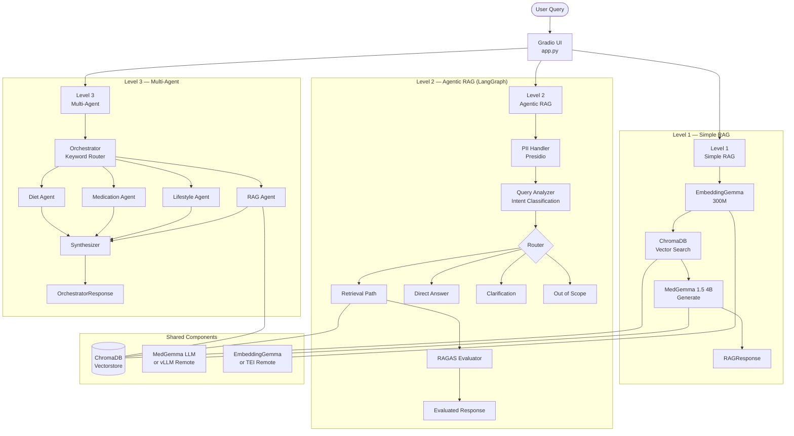

---

## 2. Level 1 — Simple RAG

**File:** `simple_rag/`

Straightforward retrieve-then-generate pipeline. Best for direct clinical questions.

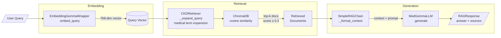

**Key classes:**

| Class | File | Role |
|-------|------|------|
| `EmbeddingGemmaWrapper` | `embeddings.py` | Embed queries and documents (MRL: 128–768 dims) |
| `CachedEmbeddingGemma` | `embeddings.py` | In-memory cache for dev/testing |
| `CKDVectorStore` | `vectorstore.py` | ChromaDB wrapper with metadata filtering |
| `CKDRetriever` | `retriever.py` | LangChain retriever + medical term expansion |
| `HybridRetriever` | `retriever.py` | Semantic + keyword search via Reciprocal Rank Fusion |
| `MedGemmaLLM` | `chain.py` | 4-bit quantized MedGemma wrapper |
| `SimpleRAGChain` | `chain.py` | Orchestrates retrieve → augment → generate |

---

## 3. Level 2 — Agentic RAG (LangGraph)

**File:** `agentic_rag/`

Stateful LangGraph workflow with PII protection, intent routing, and RAGAS evaluation.

### 3.1 Graph Structure

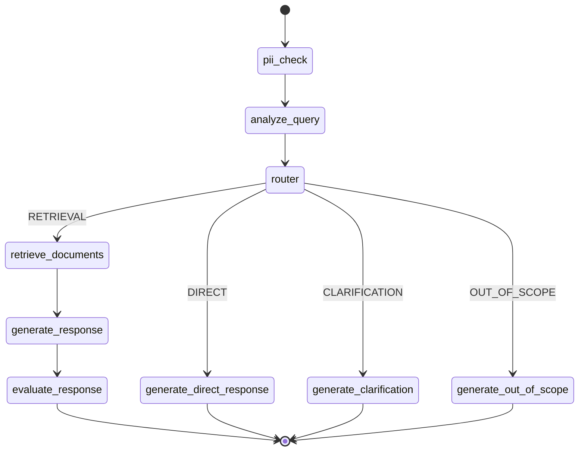

### 3.2 Detailed Node Flow

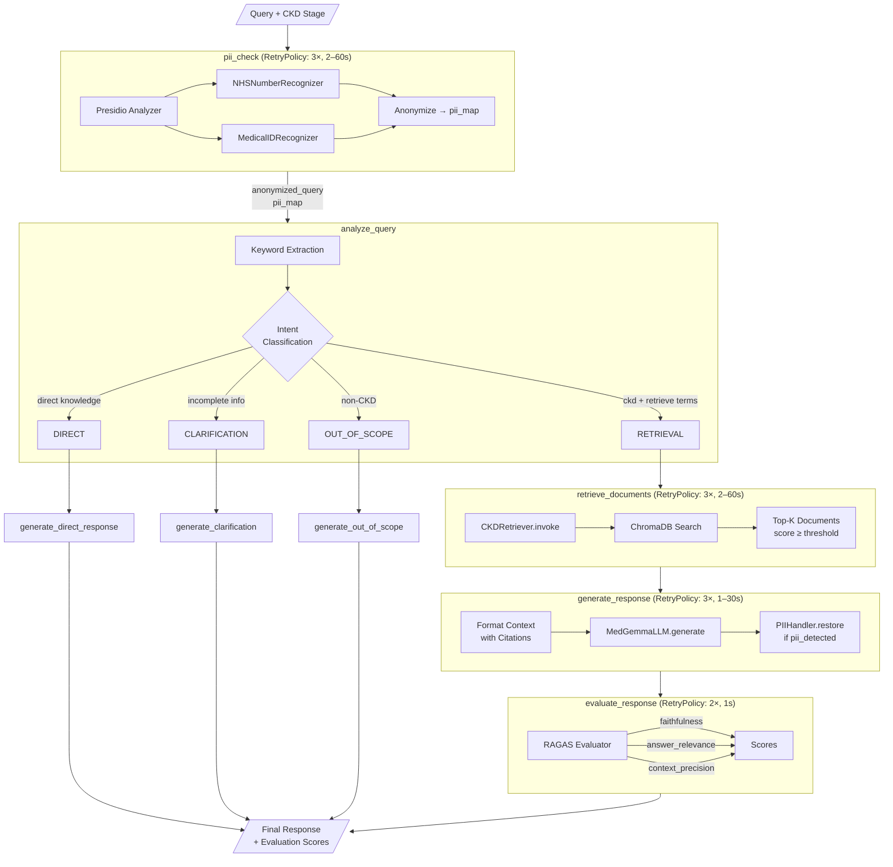

### 3.3 State Schema

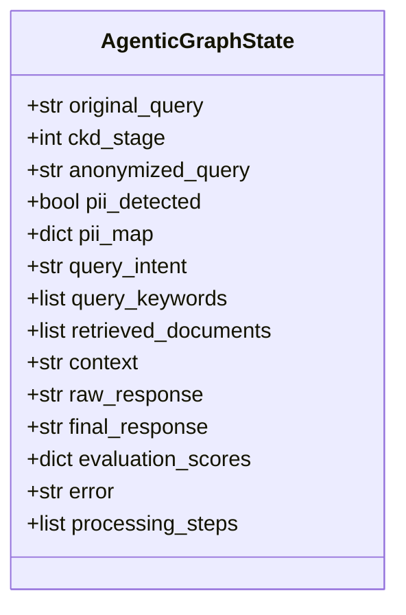

---

## 4. Level 3 — Multi-Agent Orchestration

**File:** `multi_agent_rag/`

Keyword-scored routing dispatches to one or more specialized agents. Responses are synthesized into a unified answer.

### 4.1 Orchestration Flow

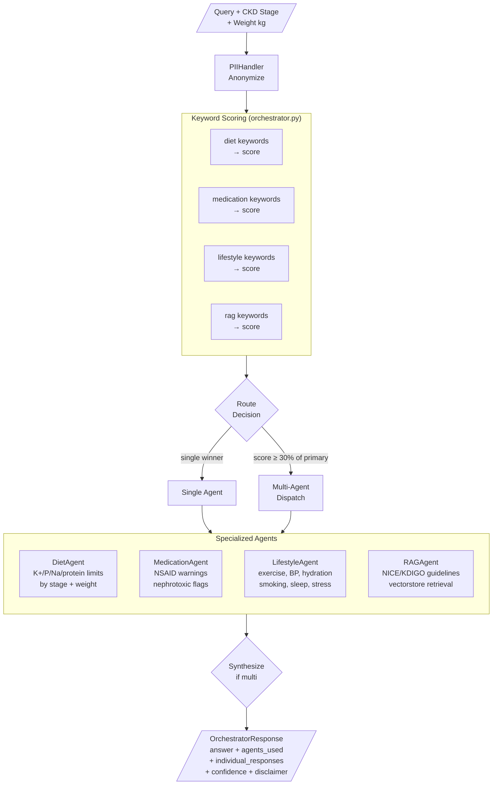

### 4.2 Agent Class Hierarchy

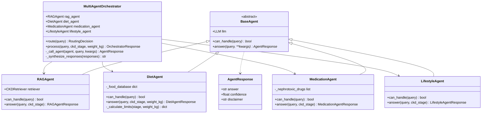

### 4.3 Routing Logic

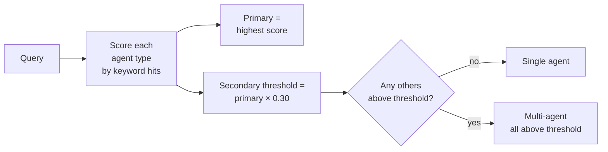

---

## 5. Component Class Diagram

Full cross-tier dependency map.

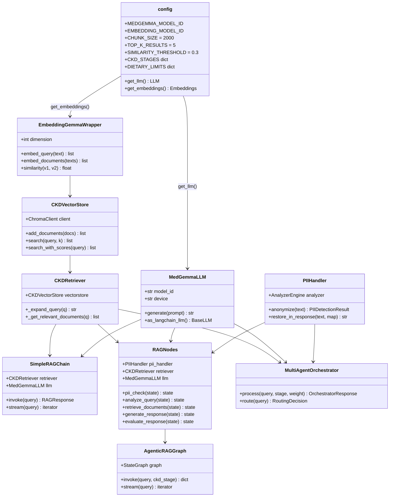

---

## 6. Data Structures

### Response Types by Level

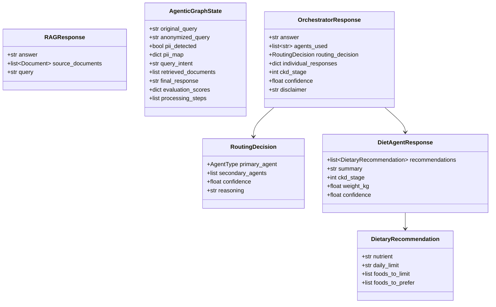

---

## 7. Infrastructure & Deployment

### 7.1 Two Deployment Modes

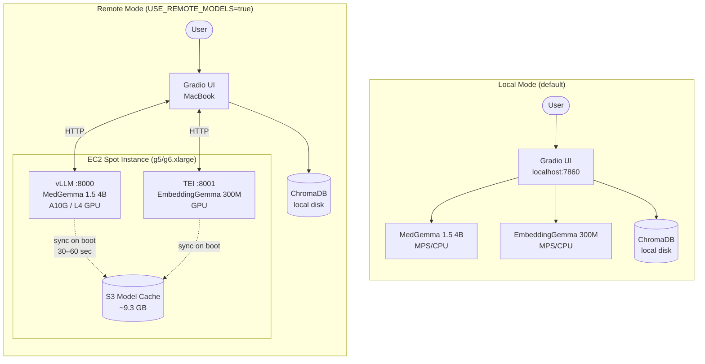

### 7.2 AWS Infrastructure (Terraform — one-time apply)

```mermaid
graph TB
    subgraph TF["terraform apply (one-time)"]
        S3[S3 Bucket\nmedgemma-models-{account_id}\nprevent_destroy=true]
        IAM[IAM Role\nmedgemma-model-server-role]
        POL[IAM Policy\ns3:Get/Put/List]
        PRF[IAM Instance Profile\nmedgemma-model-server-profile]
        SG[Security Group\nmedgemma-model-server-sg\nSSH:22 vLLM:8000 TEI:8001]

        IAM --> POL
        POL -->|allows access to| S3
        IAM --> PRF
    end

    subgraph SCRIPTS["scripts/ — per-session"]
        START[start.sh\naws ec2 run-instances\nspot one-time\n100GB EBS gp3\ndelete_on_termination=true]
        STOP[stop.sh\naws ec2 terminate-instances\nby tag Name]
        STATUS[status.sh\nid, ip, type, uptime\nby tag Name]
        SYNC[sync.sh\nrsync local → EC2\nor pull EC2 → local]
    end

    PRF -->|attached to| START
    SG -->|applied to| START
    START -->|tags| EC2I[EC2 Instance\nmedgemma-model-server]
    EC2I -->|terminated by| STOP
    EC2I -->|queried by| STATUS
    EC2I -->|synced by| SYNC
```

### 7.3 EC2 Session Workflow

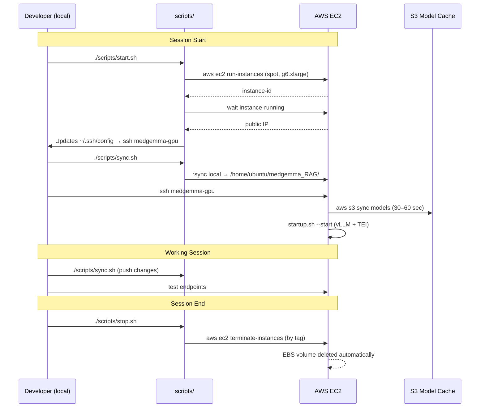

---

## 8. Developer Workflow

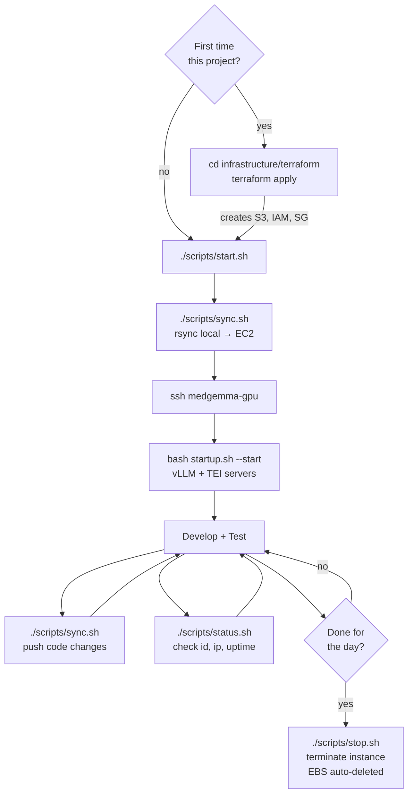

---

## Quick Reference

| Script | Command | Description |
|--------|---------|-------------|
| One-time setup | `cd infrastructure/terraform && terraform apply` | Create S3, IAM, SG |
| Launch instance | `./scripts/start.sh` | Spot g6.xlarge + 100GB EBS |
| Check status | `./scripts/status.sh` | ID, IP, type, uptime |
| Push code | `./scripts/sync.sh` | Local → EC2 rsync |
| Pull code | `./scripts/sync.sh --pull` | EC2 → local rsync |
| Terminate | `./scripts/stop.sh` | Terminate by tag name |

| Env Var | Default | Description |
|---------|---------|-------------|
| `USE_REMOTE_MODELS` | `false` | Use EC2 vLLM/TEI instead of local |
| `MODEL_SERVER_URL` | `http://localhost:8000` | vLLM endpoint |
| `EMBEDDING_SERVER_URL` | `http://localhost:8001` | TEI endpoint |
| `INSTANCE_TYPE` | `g6.xlarge` | Override in start.sh |
| `AMI_ID` | Deep Learning AMI | Override in start.sh |
